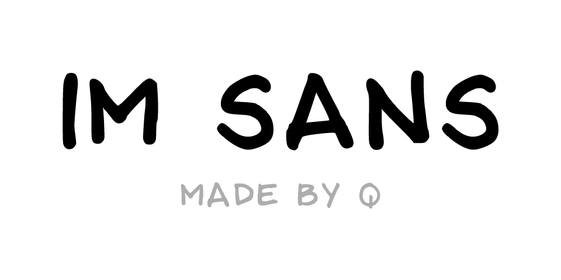

# IM Sans

Idea Machine Sans (shortened as IM Sans) is a custom font [made by Q](https://itsjonq.com/). It is based on his handwriting and is used in all forms of physical writing.

## Installation

- [macOS](https://support.apple.com/en-ca/guide/font-book/fntbk1000/mac)
- [Windows](https://support.microsoft.com/en-us/office/add-a-font-b7c5f17c-4426-4b53-967f-455339c564c1)

## Sample

Below is a sample:

